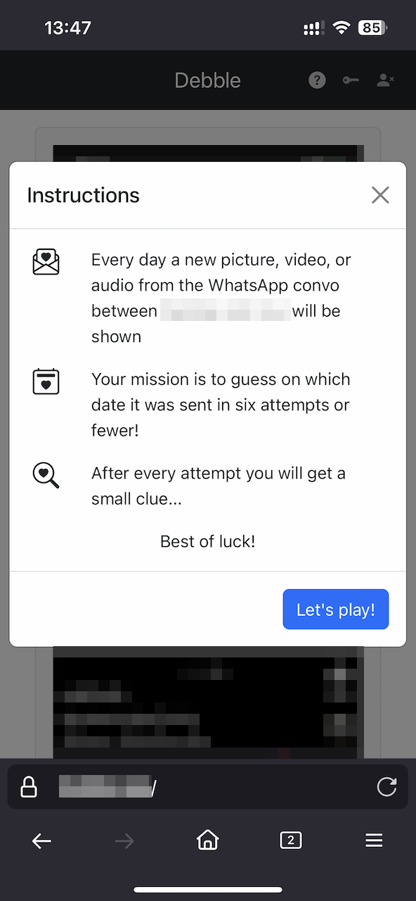

# Debble

Debble is a Wordle-inspired game that can be customized for couples or groups of friends.
In Debble, every day the players are presented with a picture, video, or audio from a WhatsApp conversation or group chat that they share.
Their goal is to guess what day the media was sent in six attempts or fewer.

This is a fun game to play with people that you chat with often, as it will spark conversations about shared memories and anecdotes.





## Setting up the machine

First, install NVM and Python 3.

```
python3 -m venv venv
source venv/bin/activate
pip install -r requirements.txt
flask --app debble init-db # Create the database
```

Depoy using:

```
./run.sh
```

## Customizing

You will want to modify at least the following values:

- The timezone used to decide when a new puzzle is shown, in `debble/utils.py`, `frontend/src/date.js`, and `frontend/src/index.js`.
- The modal with instructions, in `debble/templates/base.html`.

## Compiling the frontend

```sh
# From the root of this repo
cd frontend
nvm use 16.16
npm install
npm run build # or npm run watch
```

## Running the server

```sh
# From the root of this repo
source venv/bin/activate
flask --app debble --debug run
```

## Deploying to DigitalOcean

Debble can be deployed in a DigitalOcean Droplet.
A good way to do it is to set up an extra volume attached to the Droplet.
The volume should be mounted to the droplet in `/mnt/debble_data`.
Then, `/mnt/debble_data/instance` contains the Flask instance (the debble.sqlite file and the media folder).
Finally, there should be a soft symlink at `/home/<username>/debble/instance` pointing to `/mnt/debble_data/instance`.

To upload the media, FileZilla can be used.
Then, run `python3 load.py` in the deployment machine to add the new files to the database.
